# 🏨 HostelX – Smart Hostel Management System

HostelX is a modern **Django-based web application** built to streamline hostel operations.
It provides dedicated dashboards for **students and wardens**, enabling efficient management of rooms, complaints, fees, and daily activities.

---
## 🔐 Role-Based Access Control

The system implements role-based access to ensure secure and structured data visibility:

- 👮 **Warden Access Control**
  - Male wardens can view and manage **male students only**
  - Female wardens can view and manage **female students only**

- 🎯 **Data Segregation**
  - Student data is filtered based on assigned hostel wings (Boys/Girls)
  - Prevents unauthorized access across different hostel sections

- 🛡 **Security & Integrity**
  - Ensures privacy and controlled data handling
  - Reduces risk of cross-access or data leakage


## 🔑 Demo Login  ##

 ## Student Login 
* Student: Boy
* Email: abusufiyantechsak@gmail.com
* Password: 1234

OR 

* Student: Girl
* Email: dishapatani@gmail.com
* Password: 1234

## Warden Login --
* Warden: male_warden  
* Email: male_warden@hostel.com
* Password: male@1234

OR

* Warden: female_warden
* Email: female_warden@hostel.com
* Password: female@1234


## 🚀 Features

### 👨‍🎓 Student Panel

* Student Registration & Login
* Dashboard Overview
* Roommate Details
* Raise & Track Complaints
* Leave Application System
* Fee Management

### 👨‍💼 Warden Panel

* Secure Warden Login
* Student Management
* Complaint Resolution
* Room Transfer Requests
* Visitor Request Handling
* Leave Approval System

---

## 🛠 Tech Stack

* **Backend:** Django (Python)
* **Frontend:** HTML, CSS, JavaScript
* **Database:** SQLite
* **Version Control:** Git & GitHub

---

## 📸 Screenshots

### 🔐 Authentication

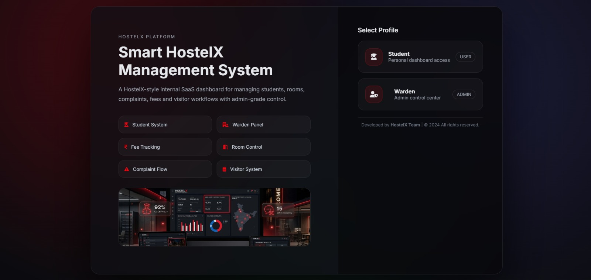
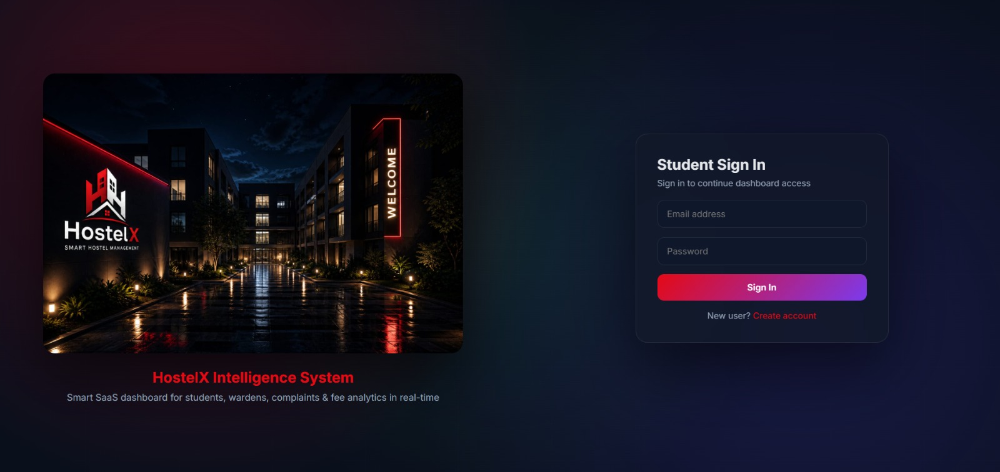
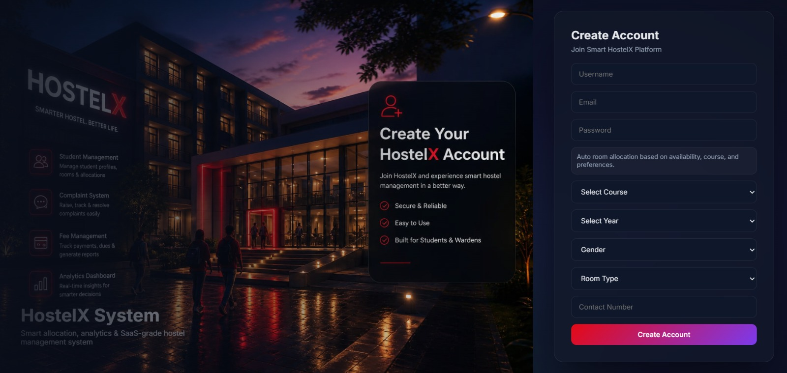
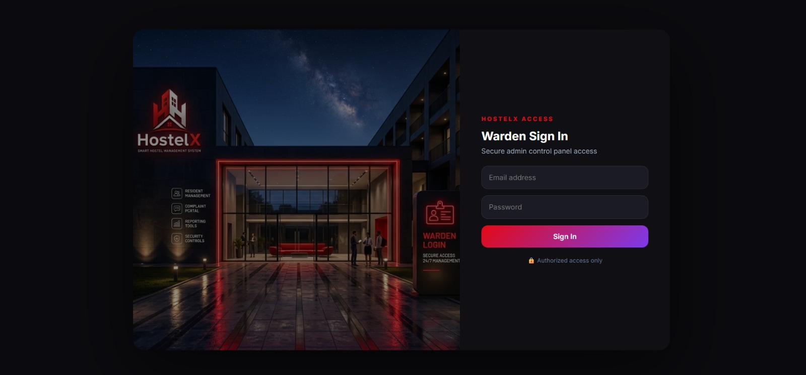

---

### 🎓 Student Panel

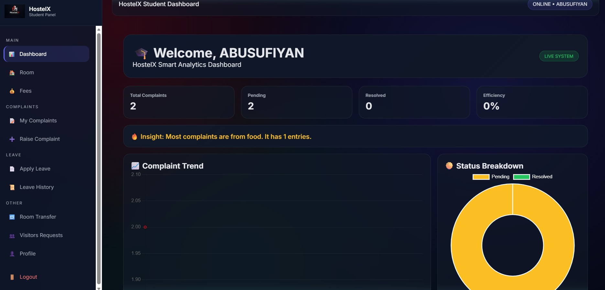
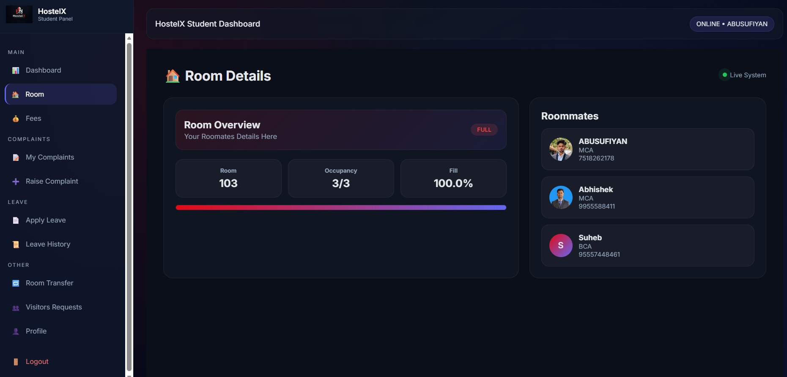
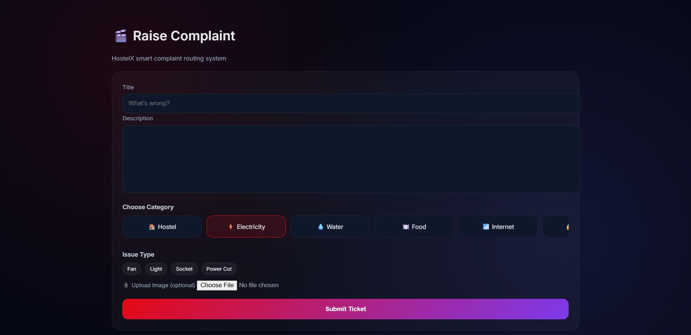
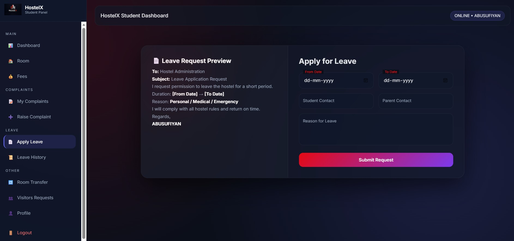

---

### 🛠 Warden Panel

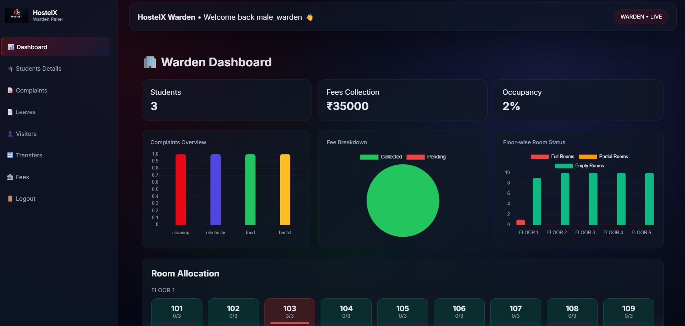
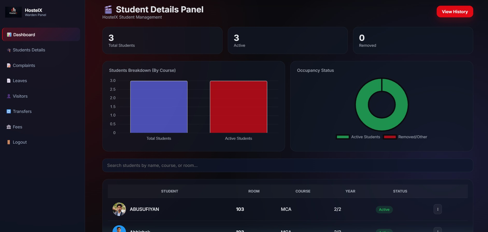
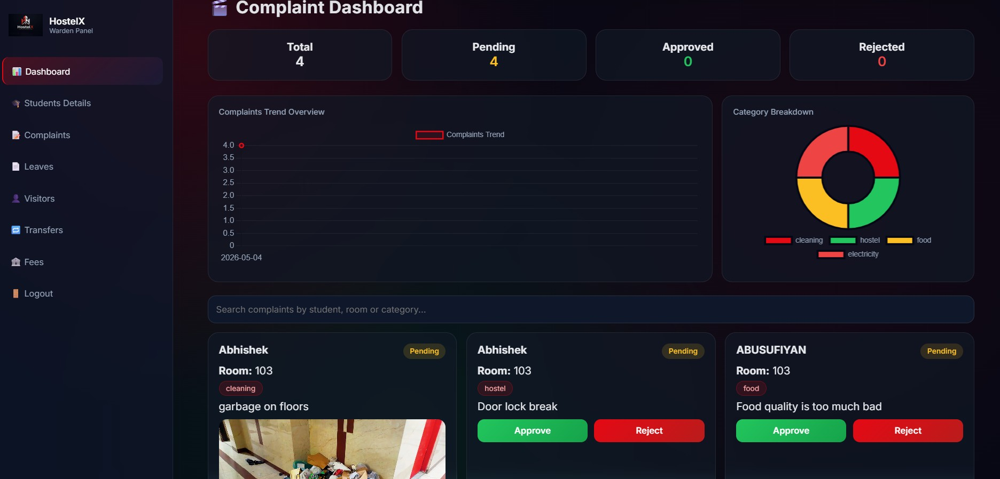

---

## 📂 Project Structure

```
HostelX/
├── myproject/                # Django settings & configuration
├── ComplainXHostel_app/     # Main application
│   ├── templates/
│   ├── static/
│   │   └── images/screenshots/
├── media/                   # Uploaded files
├── manage.py
├── requirements.txt
├── README.md
├── .gitignore
```

---

## ⚙️ Installation & Setup

```bash
git clone https://github.com/your-username/HostelX.git
cd HostelX

# Create virtual environment
python -m venv myenv

# Activate (Windows)
myenv\Scripts\activate

# Install dependencies
pip install -r requirements.txt

# Apply migrations
python manage.py migrate

# Run server
python manage.py runserver
```

---


## 🚀 Future Improvements

* 💳 Payment Gateway Integration
* 📧 Email Notifications
* 📊 Admin Analytics Dashboard
* 📱 Improved Mobile Responsiveness

---

## 👨‍💻 Author

**Abusufiyan**
Aspiring Python Developer

* GitHub: https://github.com/abusufiyan7518
* LinkedIn: https://www.linkedin.com/in/abu-sufiyan-822b9827b/

---

## ⭐ Support

If you found this project helpful, consider giving it a ⭐ on GitHub!
